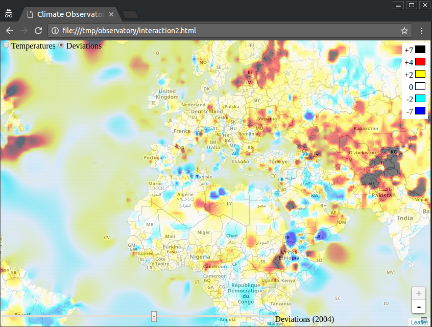

# fp-in-scala-capstone
Capstone project for the Functional Programming in Scala Specialization on Coursera

## Overview

In this project we are given temperature data from the National Center for
Environmental Information of the United States. The data consists of weather
stations located throughout the world and yearly temperature records at those
locations.

The goal of the project is to extract the temperature data and produce an
interactive and zoomable visualization of temperatures and temperature
deviations across the world, using the weather station data to interpolate for
geophraphic coordinates for which we don't have temperature data. The image
below depicts the end result.

Apache Spark is employed to parallelize the spational interpolation, Web
Mercator projection, and color map overlay generation steps of the ETL
pipeline.

## Data

Due to size, the data is not included directly in this repo, but it can be
downloaded from [here](http://alaska.epfl.ch/files/scala-capstone-data.zip).
